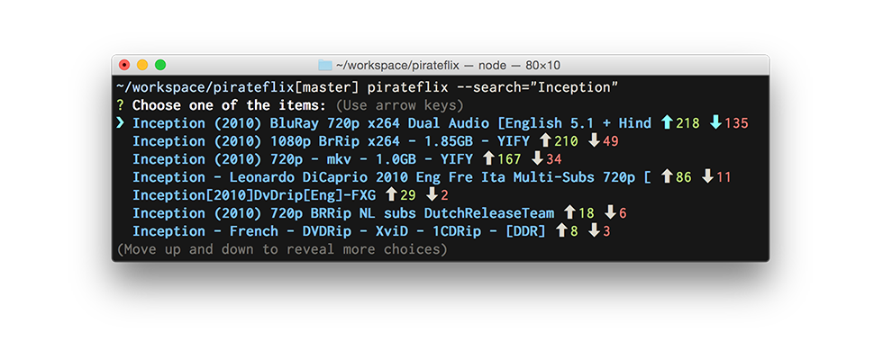

# pirateflix

> Stream piratebay movies directly from CLI



## Install

```sh
$ npm install pirateflix -g
```

## Options

```sh
$ pirateflix --help
  Follow the steps by the wizard and
  make sure you have VLC installed.

  Options:
    --search Optional value to start the query.
    --history Starts with the history of watched torrents.
    --clear Clears history of watched torrents.

  Usage:
    pirateflix [options]
```


## Usage

```sh
$ pirateflix # will open movie wizard
$ pirateflix --search="Interstellar" # will permorf a search
```

## Overview

Make sure you have VLC installed, it might take a while until the movie starts depeding on the number
of seeders/leechers. The movie will start streaming at `http://localhost:8888` you can always
manually access and check it out.

## Related

* [peerflix](https://github.com/mafintosh/peerflix)

## License

MIT © [Weslley Araujo](https://twitter.com/_weslleyaraujo)
